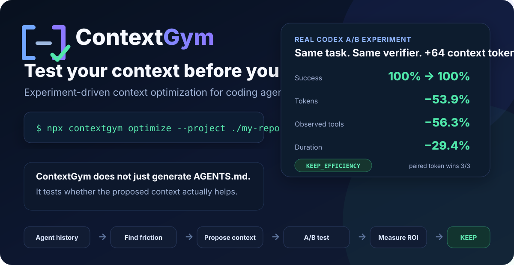

<div align="center">



<br />

[](https://www.npmjs.com/package/contextgym)
[](https://github.com/zxkbjtu/contextgym/actions/workflows/ci.yml)
[](LICENSE)
[](https://nodejs.org/)

</div>

> **ContextGym doesn't just generate `AGENTS.md`. It tests whether the proposed context actually helps.**

```bash
npx contextgym doctor
npx contextgym optimize --project ./my-repo
```

ContextGym learns from coding-agent history, finds recurring repository friction, proposes compact context, and runs paired A/B experiments to measure whether that context improves agent behavior enough to justify its cost.

## Why ContextGym

Coding agents increasingly depend on `AGENTS.md`, `CLAUDE.md`, repository maps, skills, and other context. The hard question is no longer only *what can we tell the agent?* It is:

> **Which context actually improves the agent enough to justify its cost?**

ContextGym turns that into an experiment.

## Real Codex benchmark

One real repository-navigation optimization used 3 paired Codex runs with the same repository state, task, verifier, and sandbox. The candidate differed only by approximately 64 tokens of repository context.

```text
                           Baseline       ContextGym
Success                    100%           100%
Mean token change                         -53.9%
Observed tool change                      -56.3%
Mean duration change                      -29.4%
Paired token wins                         3/3
Verdict                    KEEP_EFFICIENCY
```

An earlier independent 3-pair run on the same target also retained 100% success while reducing mean total tokens by 40.0%, observed tool calls by 31.6%, and duration by 40.1%.

These are **task-specific benchmark results**, not universal performance claims. ContextGym exists to generate evidence for a particular context change on a particular repository/task.

## Quick start

### From source

```bash
git clone https://github.com/zxkbjtu/contextgym.git
cd contextgym
npm install
npm run build
node dist/index.js doctor
```

For local CLI development:

```bash
npm link
contextgym --version
```

### Quick start with npm

```bash
npx contextgym doctor
npx contextgym optimize --project ./my-repo
```

## One-command optimization

```powershell
contextgym optimize `
  --project "D:\path\to\repo" `
  --runs 3 `
  --top 1
```

ContextGym will:

1. parse privacy-safe Codex rollout history;
2. mine repeated friction;
3. filter environment/workflow noise;
4. generate a compact repository-context draft;
5. build deterministic context probes;
6. preview the number of planned Codex invocations;
7. run isolated baseline/candidate Git-worktree experiments after confirmation;
8. calculate KEEP/REJECT and Context ROI.

Unattended execution requires explicit opt-in:

```powershell
contextgym optimize --project "D:\path\to\repo" --runs 3 --top 1 --yes
```

Already parsed your history? Reuse it:

```powershell
contextgym optimize --project "D:\path\to\repo" --reuse-events --runs 3 --top 1 --yes
```

## Review the evidence

Generate a standalone local HTML report:

```powershell
contextgym report `
  --report ".contextgym\optimizations\<report>.json" `
  --open
```

The report shows success, token/tool/time deltas, paired wins, gross token leverage, probe-level verdicts, and run metadata.

## Apply only validated context

`optimize` never modifies the real target repository. Applying is a separate explicit action.

Preview:

```powershell
contextgym apply `
  --report ".contextgym\optimizations\<keep-report>.json" `
  --dry-run
```

Apply after review:

```powershell
contextgym apply `
  --report ".contextgym\optimizations\<keep-report>.json" `
  --yes
```

ContextGym writes only a managed block in root `AGENTS.md`:

```markdown
<!-- contextgym:start -->
<!-- source: ... · proposal-sha256: ... -->
## Repository map

- `manuscript/sections/experiments.tex` - manuscript source (experiments): Experimental Evaluation. Read before editing or validating this manuscript component.
<!-- contextgym:end -->
```

Human-authored content outside the markers is preserved. By default, `apply` refuses to run if the result is not `KEEP` or if the repository `HEAD` has changed since evaluation.

## Commands

```text
contextgym doctor
contextgym sessions inspect
contextgym sessions parse
contextgym mine
contextgym propose
contextgym probe
contextgym eval
contextgym roi
contextgym optimize
contextgym report
contextgym apply
```

## What it detects

- repeated failed commands;
- failed-command → successful-command recovery patterns;
- blind polling/retry loops;
- repeated repository-file discovery;
- aborted turns;
- cross-project environment/toolchain failures;
- repository vs environment vs workflow vs investigate scope;
- low-value/generated/external-file noise;
- compact repository-map candidates;
- command-rule candidates.

Proposal generation can inspect lightweight local structure such as Markdown headings, Python symbols, and LaTeX sections. It does not copy source files wholesale into agent context.

## Evaluation design

ContextGym compares two isolated worktrees created from the same `HEAD`:

```text
Baseline                  Candidate
same HEAD                 same HEAD
control commit            context-only commit
same task                 same task
same verifier             same verifier
```

One paired run is `SMOKE_ONLY`. Evidence-bearing KEEP/REJECT verdicts require at least three paired runs.

When a deterministic verifier is configured, that verifier is the final task-success authority. Recoverable intermediate agent errors do not override a passing verifier.

Tool-call metrics are explicitly labeled **observed tool calls** because upstream agent event streams can omit internal/unified calls.

## Privacy and local-first defaults

- full conversation text is not stored by `sessions parse` unless `--include-text` is explicitly requested;
- common tokens, keys, and passwords are redacted from stored command reports;
- proposal generation is local and deterministic;
- no ContextGym cloud account, telemetry, or API key is required;
- A/B runs reuse the user's locally installed Codex CLI;
- `optimize` does not silently modify the target repository.

## Current support

**Codex:** end-to-end history parsing, mining, proposal generation, probes, A/B evaluation, ROI, report, and apply.

**Claude Code:** environment/session discovery exists; full end-to-end history normalization/evaluation is planned.

The evaluator currently uses Git worktrees, so the target project must be a Git repository. Snapshot isolation for non-Git folders is planned.

## Development

Requirements:

- Node.js 22+
- Git
- Codex CLI for real evaluation workflows

```bash
npm install
npm run check
npm run build
node dist/index.js --help
```

See [CONTRIBUTING.md](CONTRIBUTING.md), [SECURITY.md](SECURITY.md), and [docs/benchmark-policy.md](docs/benchmark-policy.md).

## Release preparation

This repository includes:

- cross-platform GitHub Actions CI;
- npm package allowlisting and `prepack` build;
- issue / PR templates;
- a public benchmark policy;
- a 30-second demo script;
- a release checklist.

See [docs/release-checklist.md](docs/release-checklist.md).

## Philosophy

> **Repeated behavior is evidence, not automatically a rule.**

A context candidate should be **small, repository-specific, testable, and retained only when paired evidence supports it**.

## License

MIT
